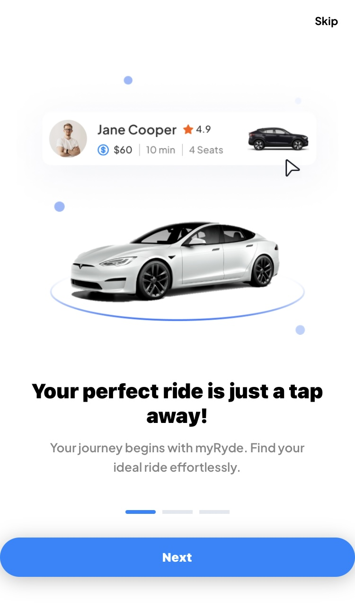
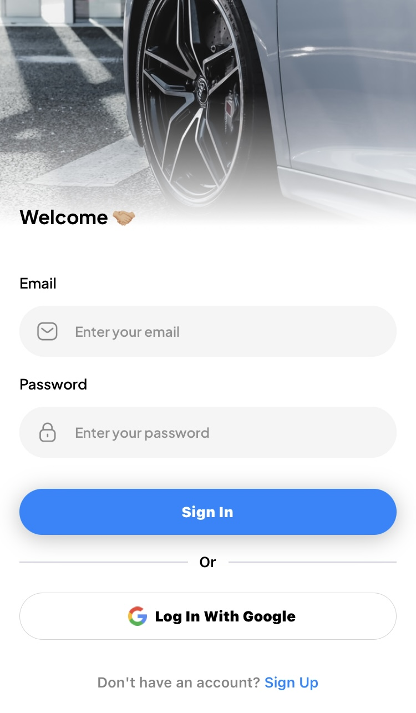
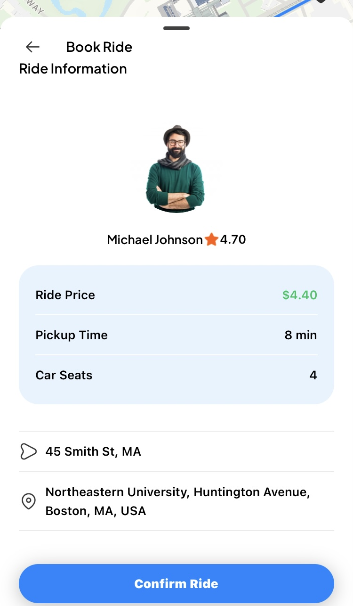

# myRyde Application

**myRyde** is a cross-platform ride-booking app built using React Native and Expo. It provides users with a seamless experience for finding and booking rides, managing profiles, and making secure payments. The app is designed to be responsive on both Android and iOS, offering a feature-rich and intuitive interface.

## Table of Contents
- [Tech Stack](#tech-stack)
- [Features](#features)
- [Main Screens](#main-screens)
- [Requirements](#requirements)
- [Installation](#installation)
- [Usage](#usage)
- [Contact](#contact)

## Tech Stack


## Features
- **Onboarding**: Seamless user registration and setup process.
- **Authentication & Authorization**:
  - Email and password login with email verification.
  - OAuth login using Google credentials.
  - Role-based secure access control.
- **Home Screen**:
  - Real-time location tracking displayed on a Google Map.
  - Interactive map markers for enhanced user experience.
- **Ride Management**:
  - View recent rides.
  - Google Places Autocomplete for effortless location search.
  - Find rides by entering 'From' and 'To' locations.
  - Select available rides from the map.
  - Confirm ride details, including time and fare price.
- **Payments**:
  - Secure payments via Stripe integration.
  - Book rides after successful payment.
- **Profile Management**: Update and manage account details in the profile section.
- **Ride History**: Access a complete history of all booked rides.
- **Cross-Platform Compatibility**: Optimized for both Android and iOS devices.

## Main Screens
1. **Onboarding Screen**: Guides users through registration and app setup.

<div style="text-align: center;">


</div>

2. **Login Screen**: Allows secure login using email/password or Google OAuth.

<div style="text-align: center;">


</div>

3. **Home Screen**: Displays live location and recent rides with map integration.

<div style="text-align: center;">


</div>

4. **Ride Search Screen**: Enables users to search and confirm rides.

<div style="text-align: center;">


</div>

5. **Payment Screen**: Facilitates secure payments via Stripe.

<div style="text-align: center;">


</div>

6. **Profile Screen**: Manages user details and account settings.

<div style="text-align: center;">

</div>

7. **History Screen**: Displays a detailed history of all past rides.

<div style="text-align: center;">

</div>

## Requirements
- Node.js **16.x** or later
- Expo CLI **6.0** or later
- PostgreSQL **13.0** or later
- Stripe account for payment integration
- Google Maps API key

## Installation
To set up this project on your local machine, follow these steps:

### 1. Clone the Repository
```bash
git clone https://github.com/hrishikasamani/myRyde
cd myRyde
```

### 2. Install Dependencies
Install the required dependencies using npm or yarn:
```bash
npm install
# or
yarn install
```

### 3. Configure Environment Variables
Create a `.env` file in the root directory and add the following:
```bash
EXPO_PUBLIC_CLERK_PUBLISHABLE_KEY=....
EXPO_PUBLIC_PLACES_API_KEY=....
EXPO_PUBLIC_DIRECTIONS_API_KEY=....
DATABASE_URL=your_postgresql_database_url
EXPO_PUBLIC_SERVER_URL=https://uber.dev/
EXPO_PUBLIC_GEOAPIFY_API_KEY=....
EXPO_PUBLIC_STRIPE_PUBLISHABLE_KEY=your_stripe_api_key
STRIPE_SECRET_KEY=....
```

### 4. Start the Development Server
Run the app using Expo:
```bash
expo start
```

### 5. Run the App on Android or iOS
For Android, use the following command:
```bash
expo run:android
```

For iOS, use the following command:
```bash
expo run:ios
```

### 6. Build for Production
To build the app for production, run the following command:
```bash
expo build:android
or
expo build:ios
```

### 7. Test the App
You can test the app by scanning the QR code displayed in the terminal using the Expo Go app on your device or using an emulator.


## Usage

1. Register or log in using email/password or Google OAuth.
2. Search for rides by entering 'From' and 'To' locations.
3. Select and confirm rides using the map interface.
4. Make secure payments via Stripe to book your ride.
5. Manage your account and view ride history in the Profile section.

## Contact

If you have any questions, feel free to reach out to me or submit a pull request on this repository:

*Hrishika Samani*
  [LinkedIn](https://www.linkedin.com/in/hrishika-samani)
  [Email](mailto:samani.hr@northeastern.edu)


